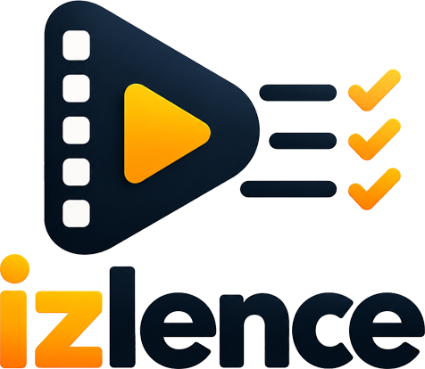

<div align="center">



# İzlence — Film Günlüğü

Film ve dizi ekle, puanla, not al. Zevkine göre öneri al, izleme alışkanlıklarını analiz et.
Tamamen tarayıcıda çalışır. Hesap yok, sunucu yok, takip yok.

**[▶ Uygulamayı aç — izlence.web.app](https://izlence.web.app)**

[](https://izlence.web.app)
[](https://izlence.web.app)
[](https://www.themoviedb.org/)
[](https://aistudio.google.com/)
[](#lisans)

</div>

---

## Ne yapar

| | |
| --- | --- |
| **Keşfet** | Film, dizi, kişi, yıl veya IMDb kodu ile arama. Sonuç çıkmazsa sorgu kademeli gevşetilir. |
| **Listelerim** | İzlediklerim, Favoriler, İzleyeceklerim. Puan, kişisel not, dizilerde sezon-bölüm takibi. |
| **Öneriler** | Zevk profiline göre skorlanmış öneriler. İstersen sadece abone olduğun platformlardan. |
| **AI** | Google Gemini zevk profilini okuyup gerekçeli öneri yapar ve seni tanıyan bir hafıza tutar. |
| **Analiz** | Tür, yönetmen, on yıl dağılımı, ekran süresi ve yıl özeti (Wrapped). |

Telefonda adresi aç, tarayıcı menüsünden **Ana ekrana ekle** de. Uygulama gibi açılır, çevrimdışı çalışır.

## Hızlı başlangıç

1. [izlence.web.app](https://izlence.web.app) adresini aç.
2. [TMDB](https://www.themoviedb.org/) üzerinden ücretsiz bir API anahtarı al (**Settings → API → Create → Developer**, onay anında gelir).
3. Uygulamada **Ayarlar → TMDB API anahtarı** alanına yapıştır ve kaydet.
4. En az üç film ekle. Öneriler ve analiz bundan sonra anlamlı çalışır.
5. İstersen [Google AI Studio](https://aistudio.google.com/app/apikey) anahtarını da ekleyip AI sekmesini aç.

Anahtarlar yalnızca senin cihazında `localStorage` içinde durur. Depoda hiçbir anahtar yoktur, bu yüzden statik yayın güvenlidir.

## Yerelde çalıştır

Service worker `file://` üzerinden çalışmaz, küçük bir sunucu gerekir.

```bash
git clone https://github.com/kamilsaim/izlence.git
cd izlence
python -m http.server 8080
# http://localhost:8080
```

## Yayınlama

Firebase Hosting üzerinde yayında. Depodaki `firebase.json` hazır gelir: SPA yönlendirmesi, `sw.js` için no-cache, görseller için uzun cache.

```bash
npm i -g firebase-tools
firebase login
firebase deploy --only hosting:izlence
```

Yeni sürüm yayınlandığında kullanıcıların uygulamayı bir kez kapatıp açması yeterlidir. Service worker önbellek adı sürüm numarasını taşır, eski kabuk otomatik temizlenir.

Depoda GitHub Pages iş akışı da duruyor. `main` dalına gönderim yapınca Pages sürümünü günceller. Firebase'i güncellemez, onu ayrıca dağıtman gerekir.

## Dosya yapısı

```
index.html              Ekranlar: Keşfet, Listelerim, Öneriler, AI, Analiz, Ayarlar
styles.css              Mobil öncelikli tasarım, otomatik koyu tema
app.js                  TMDB istemcisi, liste mantığı, öneri motoru, Gemini entegrasyonu, analiz
sw.js                   Service worker: çevrimdışı kabuk ve afiş önbelleği
manifest.webmanifest    PWA manifesti
icons/                  Uygulama ikonları ve logo
firebase.json           Firebase Hosting yapılandırması
```

Derleme adımı, paket yöneticisi ve bağımlılık yoktur. Dosyaları sunmak yeterlidir.

## Öneri motoru

Her filme zevk profilinde bir ağırlık verilir.

| Sinyal | Ağırlık |
| --- | --- |
| Favori | 3 |
| İzlendi | 2 |
| İzlenecek | 1 |
| Senin puanın | çarpan 0.5x – 1.4x |

Ağırlıklar tür, yönetmen, başrol ve on yıl bazında toplanır. Aday havuzu, en ağırlıklı beş filmin TMDB benzer film sonuçları ile zevk profilinin ilk üç türüne göre yapılan keşif sorgusundan oluşur. Skor tür uyumu, TMDB puanı ve dönem uyumundan gelir. Az oylanan yapımlar cezalandırılır, birden fazla kaynakta çıkanlar ödüllendirilir. Listende olanlar elenir.

Ayarlardan izleme platformlarını işaretlersen keşif sorgularına platform ve bölge filtresi eklenir, öneriler yalnızca o platformlarda izlenebilenlerden gelir.

## AI önerileri

Klasik motor anahtarsız çalışır. Google AI Studio anahtarı eklersen AI sekmesi açılır.

Zevk profilin metne çevrilip modele gönderilir. Model yapılandırılmış JSON döner: film adı, yıl, Türkçe gerekçe ve ruh hali etiketi. Her öneri TMDB'de aranıp afiş ve puanla eşleştirilir. Model ayrıca bir hafıza notu yazar, bu not cihazında saklanır ve sonraki isteklerde geri verilir, böylece zamanla seni daha iyi tanır.

**Model seçimi otomatik ve yetenek öncelikli.** Model adı koda sabitlenmez. Uygulama Google'ın model listesini çekip anahtarının erişebildiği modelleri sıralar: önce en yeni sürüm, aynı sürüm içinde en güçlü kademe. Zincir şöyle oluşur.

```
gemini-3-pro-preview
gemini-3-flash-preview
gemini-2.5-pro
gemini-2.5-flash
gemini-2.5-flash-lite
gemini-2.0-flash
```

Model bulunamazsa, kota dolarsa veya sunucu hatası gelirse bir alttakine geçer, en fazla sekiz deneme yapar. Anahtar hatasında denemeye devam etmez, doğrudan uyarır. Liste on iki saatte bir tazelenir. İstersen Ayarlar'dan tek bir modeli sabitleyebilirsin.

## Veri ve gizlilik

Tüm veriler cihazının `localStorage` alanında durur. Hesap, sunucu ve analitik yoktur.

**Ayarlar → JSON dışa aktar** ile yedek al, başka cihazda içe aktar. Yedeğe API anahtarlarını da ekleyen bir seçenek var, varsayılan olarak kapalıdır. Anahtarlı yedek düz metindir, sadece kendi cihazların arasında taşı.

IMDb hesabından indirdiğin `ratings.csv` dosyasını **Ayarlar → IMDb puanlarını içe aktar** ile yükleyebilirsin. Puanların ve puanlama tarihlerin taşınır, film ve dizi ikisi de desteklenir.

Tarayıcı verisini temizlersen listeler silinir. Düzenli yedek al.

## Lisans

MIT.

---

<div align="center">

Bu ürün TMDB API'sini kullanır ancak TMDB tarafından onaylanmamış veya sertifikalandırılmamıştır.

Geliştirici: [kamilsaim](https://github.com/kamilsaim)

</div>
